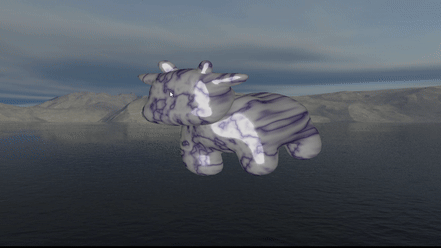
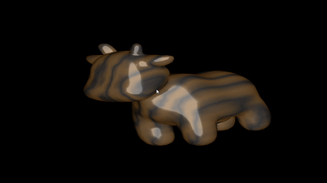
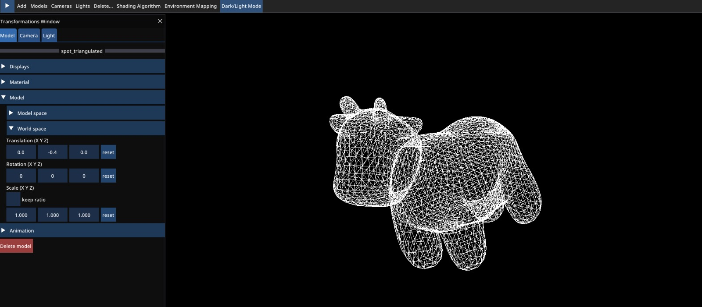
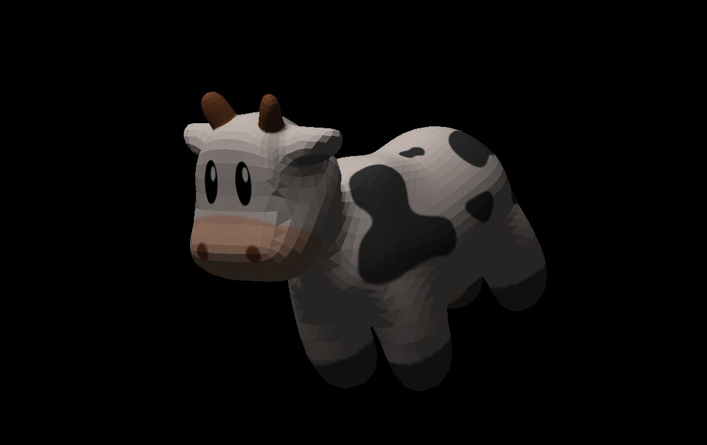
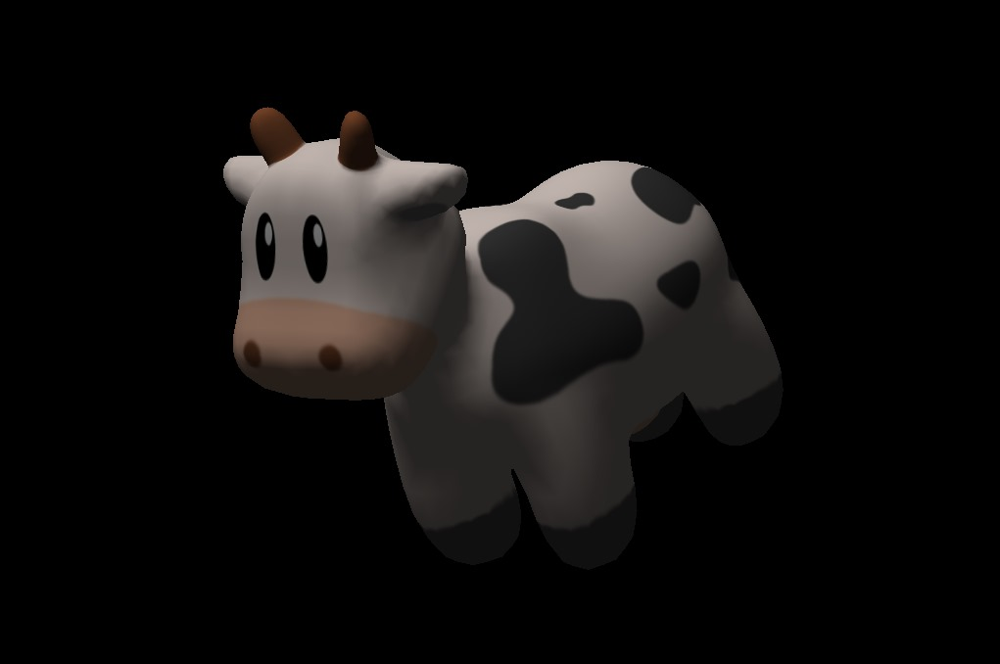
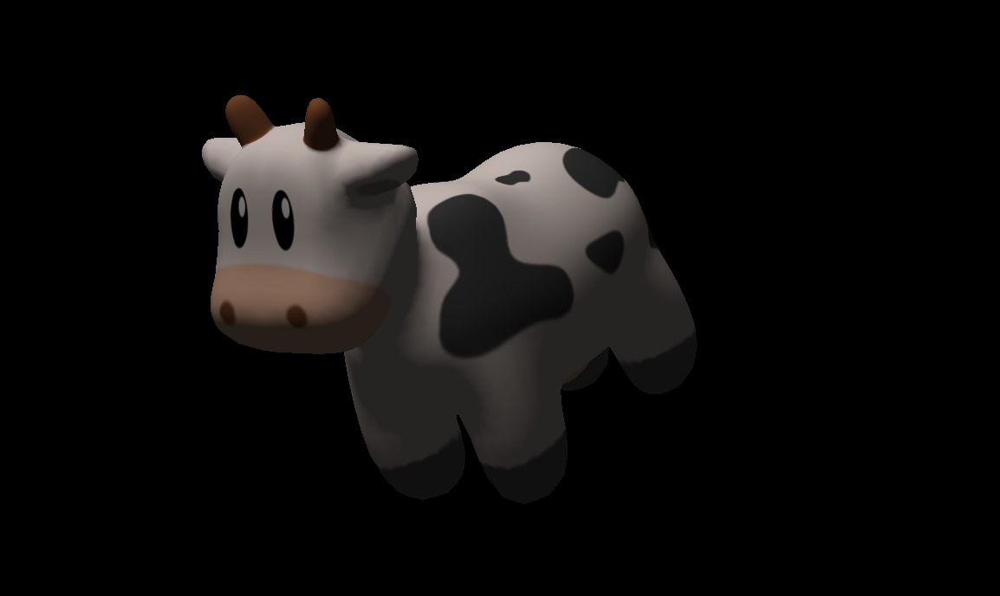
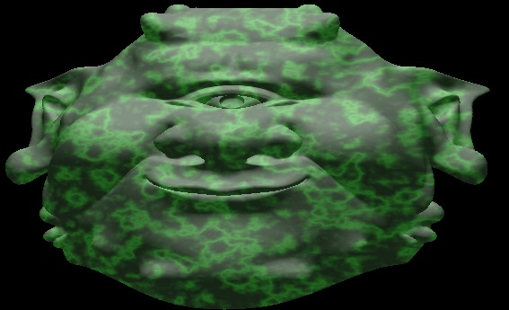
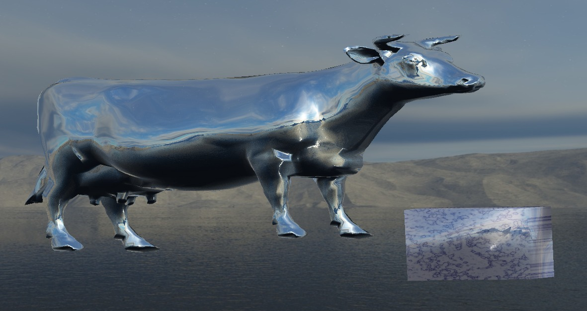
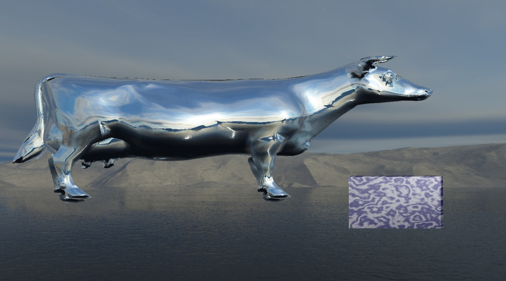
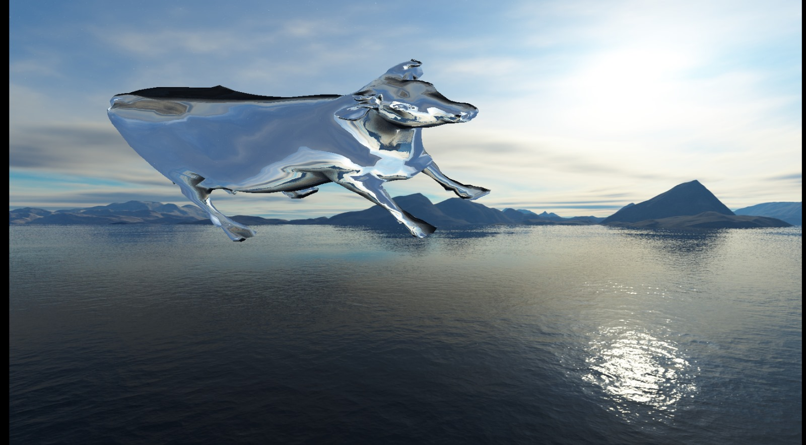

# Computer Graphics 3D-Rendering Application

This is the final homework assignment submission in the "Computer Graphics - 236216" course at the Technion.
The project showcases various computer graphics techniques including:
1. Shading algorithms: Flat, Gouraud and Phong.
2. Lighting consists of Emissive, Diffuse and Specular customizable colors.
3. Texture mapping.
4. Skybox background with mirror effect.
5. Multiple different models, lights and cameras in a single scene.
6. Marble effect generator.

## Showcase

### Skybox Mirror effect

### Marble effect

### Wood effect

### Wireframe

### FLAT shading

### Gouraud shading

### Phong shading

### Cool Green Face

### Skybox1

### Skybox2

### Skybox3

